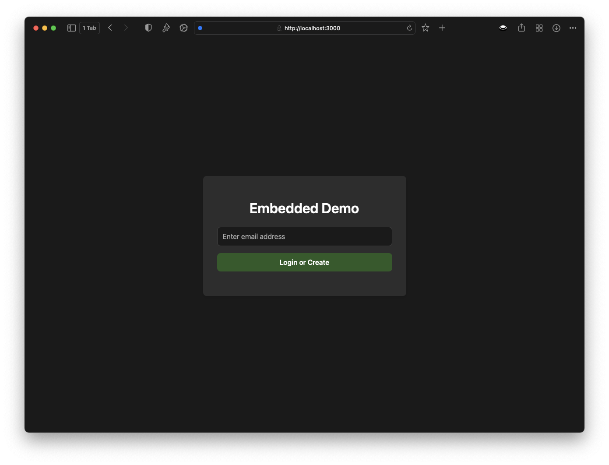
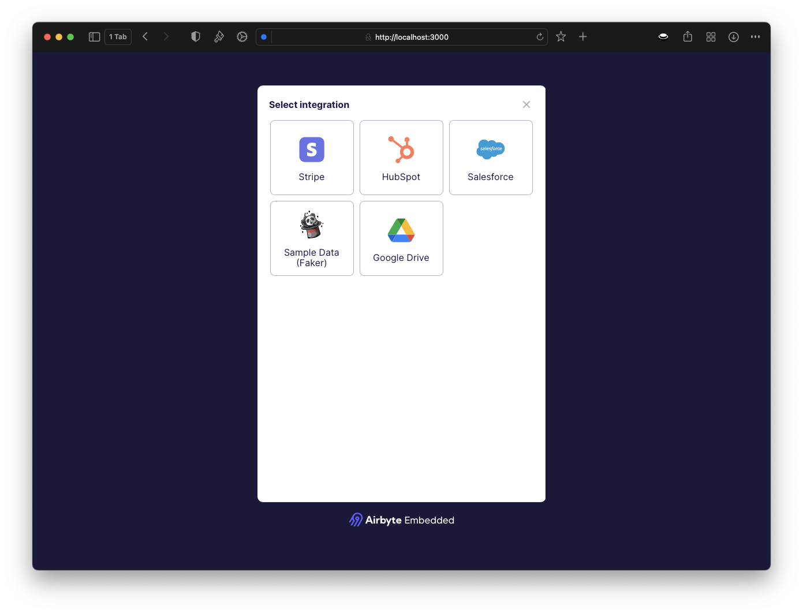
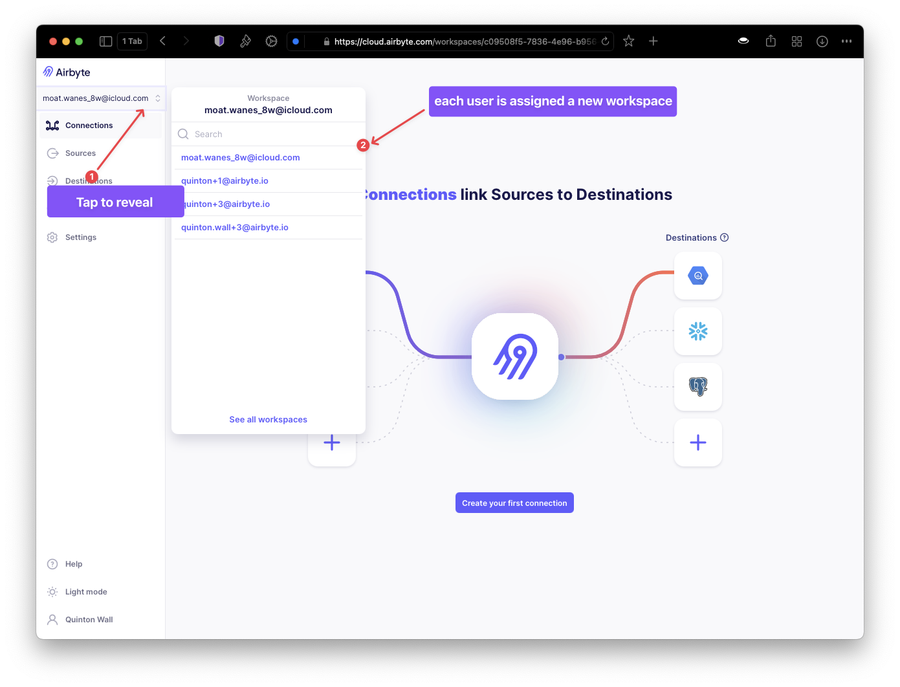

# Getting Started with Airbyte Embedded

This repo contains a sample Node.js webapp, which includes the [Airbyte Embedded](https://airbyte.com/embedded) widget that you can use to add clients.

## Pre-requisites

### Airbyte credentials
To use Airbyte Embedded, must have an active Airbyte Cloud, or OSS, instance with Embedded enabled. (Please [contact sales](https://share.hsforms.com/2uRdBz9VoTWiCtjECzRYgawcvair) if you would like to sign up for Airbyte Embedded).
Once you have you your Airbyte instance available, log in and note down the following values. You will need these to configure the webapp and one-time setup.

- Orangization Id: Unique identifier to your Airbyte instance. Obtained via Settings > Embedded
- Client Id: Unique API id. Obtained via Settings > Applications > Create Application
- Client Secret: Secret key for authentication . Obtained via Settings > Applications 
- External User Id: A unique identifier you create and assign when generating an Embedded Widget. It's the identifier used to differentiate between unique users. You should create one unique identifier for each of your users. For testing, you may set it to 0.

If you are still unsure where to retrieve these values, please [watch this video](https://youtu.be/H6ik3HAj0iY) for a walkthrough.

### .Env
Once you have the credentials, create a new `.env` file, based on `.env.example` container within the repo. Set the following keys to the values from above:

<pre>
AIRBYTE_ORGANIZATION_ID=your_organization_id
AIRBYTE_CLIENT_ID=your_client_id
AIRBYTE_CLIENT_SECRET=your_client_secret
</pre>

### Configure S3 for storing users
Users created via Embedded will be stored in S3 buckets managed by you. Once you have the `.env` created with Airbyte credentials, go ahead and create an [S3 bucket](https://docs.aws.amazon.com/AmazonS3/latest/userguide/GetStartedWithS3.html) and add the following values to the `.env`:

`
# AWS Credentials
<pre>
AWS_ACCESS_KEY=your_aws_access_key
AWS_SECRET_ACCESS_KEY=your_aws_secret_access_key

# S3 Configuration
S3_BUCKET=your_s3_bucket_name
S3_BUCKET_REGION=your_s3_bucket_region
S3_BUCKET_PREFIX=your_s3_bucket_prefix
</pre>

Next, configure Airbyte to use the S3 bucket. From the command line, execute the following script to create the required connection:

<pre>
$ ./setup-s3.sh
</pre>

Once you see confirmation that the connection was set up correctly, your Airbyte Embedded environment is ready to go!

## Sample Web App
The sample web app provided in this project includes an example of utilizing the Embed widget within a Node.js app. 

### Allowed Origin
To enable the app and Airbyte to communicate, please set `ALLOWED_ORIGIN` in the `.env` to the url where you are running the sample webapp. For example, if you are running the app on your local machine using the default configuration your `.env` entry will be `ALLOWED_ORIGIN=http://localhost:3000`

### Starting the app
From the commandline, run the following command:

<pre>
node src/server.js
</pre>

then, open your browser and navigate to http://localhost:3000 to access the web interface

### Adding users
From here you can create users as required. Once you create the user, you will be presented with the Embedded widget to create connection endpoints. 

Within Airbyte, the user and connections will be assigned to a new workspace of the same name as the user you created. 

